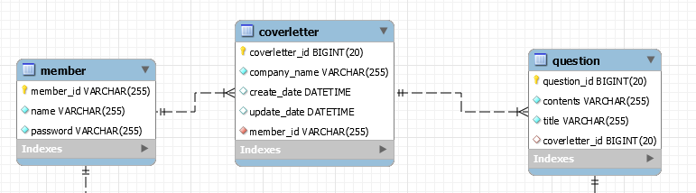

# JPA 활용기

> 토이프로젝트에서 사용했던 MyBatis를 JPA로 전환하며 느낀점을 아주 간단히 기술했습니다. 실제 경험에 기반한 글이며, 그냥 한 사람의 생각일 뿐임을 알려드립니다.


# JPA

JPA는 Java Persistence API의 약자로, Java를 사용해서 영속성(Persistence)을 다룰 수 있는 API 표준 명세입니다. 흔히 들려오는 ORM 프레임워크 중 하나이며, JPA를 구현한 기술들은 대표적으로 Hibernate가 있습니다.


## 기존의 문제

처음 토이프로젝트에서 MyBatis를 사용했습니다. 아래는 이를 사용하면서 느꼈던 문제들입니다.


중첩된 객체를 맵핑하기 위해 작성해야할 코드가 너무 많았습니다. MyBatis에서는 ResultMap을 사용해서 Query 결과를 객체에 맵핑시킵니다. 하지만 중첩된 객체가 많으면 많을수록 XML 코드는 더욱 복잡해졌고, 유지보수하기 힘들정도로 가독성이 떨어졌습니다. 


## 왜 JPA를 사용했는가?


**객체지향**과 **생산성**에 있어 MyBatis보다 유리하다고 판단했습니다. JPA는 객체지향언어와 RDB간 패러다임을 극복하는기 위한 쉬운 길을 제시하고, 이를 통해 높은 생산성을 얻을 수 있습니다.

JPA는 Query 결과를 알아서 객체에 맵핑합니다. MyBatis 처럼 복잡하고 난해한 ResultMap 코드를 작성하지 않아도 됩니다. 이러한 편리함 덕분에 앞으로 객체가 더욱 복잡해진다해도, 쉽게 대응할 수 있을 것이라는 생각이 들었습니다.


## 내가 JPA에 접근한 방법

우선 ERD를 그리며 데이터베이스 설계 작업을 한 뒤, 각각의 테이블을 Java Object로 Mapping하는 작업을 수행했습니다. JPA는 Table을 자동으로 생성하는 기능이 있기 때문에 이렇게 안해도 됩니다. 하지만 데이터베이스를 설계하고 구현하는 일도 개발자에게 필요한 역량이라고 생각합니다.

1. 아래와 같이 먼저 ERD를 그린 후, Schema를 생성했습니다.


2. Coverletter Schema를 Java Object에 맵핑했습니다. Coverletter는 Member N:1 관계이고, Question과 1:N 관계입니다.
    ```java
    @Table(name = "coverletter")
    @Entity
    public class Coverletter {

        @Id
        @GeneratedValue(strategy = GenerationType.IDENTITY)
        @Column(name = "coverletter_id")
        private long id;

        @Column(name = "company_name")
        private String companyName;

        @ManyToOne
        @JoinColumn(name = "member_id")
        private Member member;

        @OneToMany(mappedBy = "coverletter")
        private List<Question> questions = new ArrayList<>();

        @CreationTimestamp
        @Column(name = "createDate")
        private LocalDateTime createDate;

        @UpdateTimestamp
        @Column(name = "updateDate")
        private LocalDateTime updateDate;
    }
    ```

인터넷에 존재하는 JPA 예제를 보면 JpaRepository라는 인터페이스를 사용해서 쉽게 CRUD를 구현하는 모습을 볼 수 있습니다. 당시 이것을 보고 되게 편리하다는 생각을 했지만, 내부적으로 어떻게 작동하는지 이해하기 힘들었습니다. 그래서 저는 편리함보단 좀 더 돌아가서가는 길을 선택했습니다. Spring의 도움 없이 순수한 Java 프로젝트에 JPA를 활용해보거나, Spring 프로젝트에서도 JpaRepository보단 직접 EntityManager를 통해 쿼리를 작성해보면서 개발했습니다.


```java
    @PersistenceContext
    private EntityManager em;

    @Override
    public Coverletter findById(Member member, long id) {
        TypedQuery<Coverletter> query = em.createQuery(
            "SELECT c FROM Coverletter c 
             WHERE c.id =:id AND c.member =:member", 
             Coverletter.class);
        query.setParameter("id", id);
        query.setParameter("member", member);

        List<Coverletter> result = query.getResultList();
        return result.isEmpty() ? null : result.get(0);
    }
    
```


## 끝으로

JPA가 정답은 아닙니다. 


JPA는 객체지향과 RDB간 문제 해결을 위해 등장한 하나의 기술입니다. 다만, 저의 작은 경험에 비추어봤을 때 아직까지 저에겐 MyBatis보단 JPA가 더 낫다고 생각했을 뿐입니다. 경험이 쌓이면 언젠가는 JPA의 단점이 눈에 띌 것이라고 생각합니다. 그럼 그때가서 다른 대안을 찾아도 늦지 않습니다.


JPA는 Java 진영의 ORM 기순 표준이고 Spring Framework에서도 이를 정식으로 지원하고 있습니다. 표준인만큼 Java 개발자라면 한번쯤은 배우고 알아둘 필요는 있다고 생각합니다.


우리가 사는 세상에도 완벽한 솔루션을 제공하는 것은 존재하지 않습니다. 최저시급 인상이라는 제도가 결국 직원을 해고하게 만들었듯이 말입니다. 소프트웨어 생태계도 똑같다고 생각합니다. 문제를 해결하기 위한 여러가지 이론과 기술들도 또 다른 문제를 야기합니다. 그렇기 때문에 우리는 우리의 상황에 맞는 것을 사용해야 합니다.

