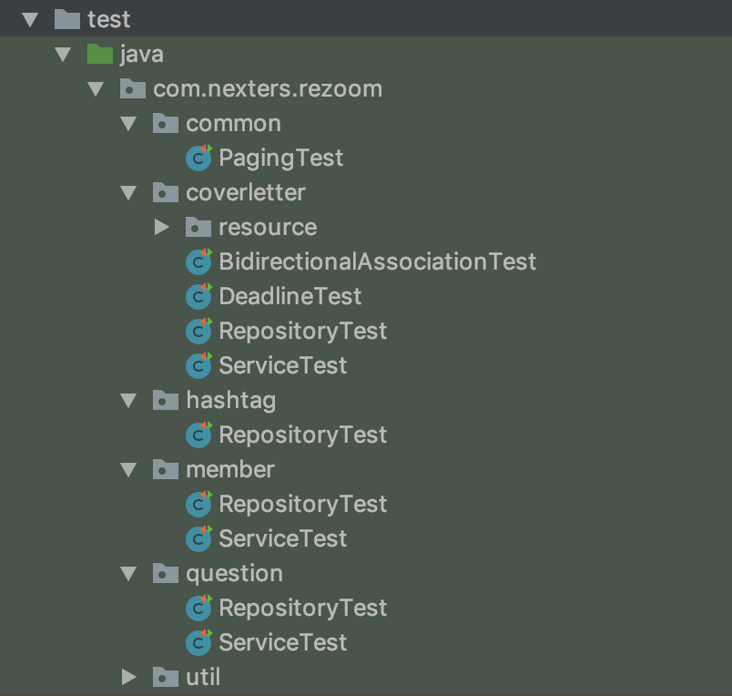
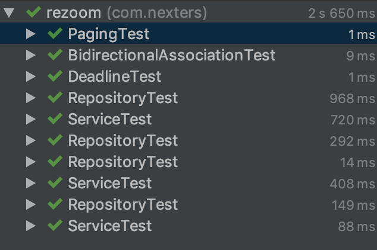
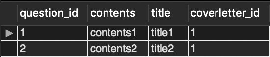

# 테스트 코드를 리팩토링 해보자 - 유지보수편

이번에 토이프로젝트를 하면서 처음으로 테스트 코드를 작성했습니다. 단위 테스트에 대한 이론적인 지식이나 JUnit을 사용하는 방법을 모른채 진행하다보니 DB, 성능, 코드스멜 등 여러 가지 문제점이 많았습니다. 토이프로젝트라 규모가 작아서 안해도 되지만 실력을 키우고자 리팩토링을 해봤습니다.

크게 2가지 관점에서 리팩토링했습니다.
- [유지보수](./)
- 성능 (작성 예정)

---

# 문제 & 해결

## 1. 테스트 클래스 이름 문제


테스트 클래스 이름을 위와 같이 만들었습니다. 겉보기에 뭘 테스트하는지 유추는 어느 정도 가능해 보입니다만, 이렇게 했을 때 아래와 같은 문제점이 있었습니다.



어떤 테스트가 성공했는지, 실패했는지, 시간은 얼마나 걸렸는지 분별하기 힘듭니다. domain package 안에 service, repository가 공통적으로 있으니 오히려 domain+ServiceTest와 같이 네이밍하는 것이 번거롭다고 생각했었습니다. 하지만 테스트 결과 분석이 겉보기에 어렵다는 것을 알 수 있습니다.

이 문제를 해결하는 방법은 클래스 이름을 구체적으로 작성하는 것입니다. 이제 무엇에 대한 테스트 결과인지 직관적으로 알 수 있습니다.

```
변경 전 : coverletter/RepositoryTest.java 
변경 후 : coverletter/CoverletterRepository.java
```

## 2. 테스트 데이터 설정 문제

Repository 또는 Service 테스트를 하려면 필연적으로 데이터베이스를 사용해야 합니다. 따라서 테스트 코드에 초기 데이터를 설정하는 코드가 많습니다.

일례로 모든 Entity는 대체적으로 user를 참조하고 있기 때문에 @Before 클래스에 User Insert 코드가 6개나 있습니다. 만약 서비스가 더 커진다면? 수도 없이 많아지겠죠.

이를 해결하기 위해 상속을 사용해서 공통적인 로직을 처리하려는 생각을 했습니다. 하지만 상속은 대체로 쓰지 않는 편이 바람직하다는 말을 객체지향 공부할 때 많이 들어서 하기 싫었습니다. ~~다른 방법이 있음에도 상속을 사용한다는 것은 꼭 필요할 때 사용할 수 없는 문제가 생기고, 그러면 이거 수정하느라 또 고생해야 하고.... 끔직..~~

이를 해결하기 위해 선택한 방법은 초기 프로젝트 로딩시 필요한 데이터를 미리 데이터베이스에 저장하는 것입니다. 이를 위해 spring boot에서 지원하는 data.sql을 사용했습니다.

resources에 data.sql 파일을 생성해주고 아래와 같이 필요한 데이터를 생성할 수 있는 Query를 정의했습니다.

```sql
INSERT INTO member VALUES ('test', 'tester', 'test');

INSERT INTO coverletter
(
    company_name, application_year, application_half, application_type,
    is_application, is_pass, deadline, job_type, member_id
)
VALUES
(
    'testComapany1', '2019', '상반기', '경력',
    '0', '0', '2019-06-01', 'Backend Engineer', 'tester'
);

SET @coverletter_id = LAST_INSERT_ID();

INSERT INTO question
(coverletter_id, title, question) VALUES (@coverletter_id, 'title1', 'contents1');

SET @question_id1 = LAST_INSERT_ID();

INSERT INTO question
(coverletter_id, title, question) VALUES (@coverletter_id, 'title2', 'contents2');

-- 생략
```

이제 application을 실행하고, 데이터베이스를 확인할 차례입니다. 잘 저장되었습니다 :)



이제 테스트를 위해 필요한 데이터가 마련되었으므로, 불필요한 로직을 제거할 수 있습니다! 테스트 클래스마다 존재했던 memberService bean과 TestObjectUtils 클래스를 제거했습니다.


