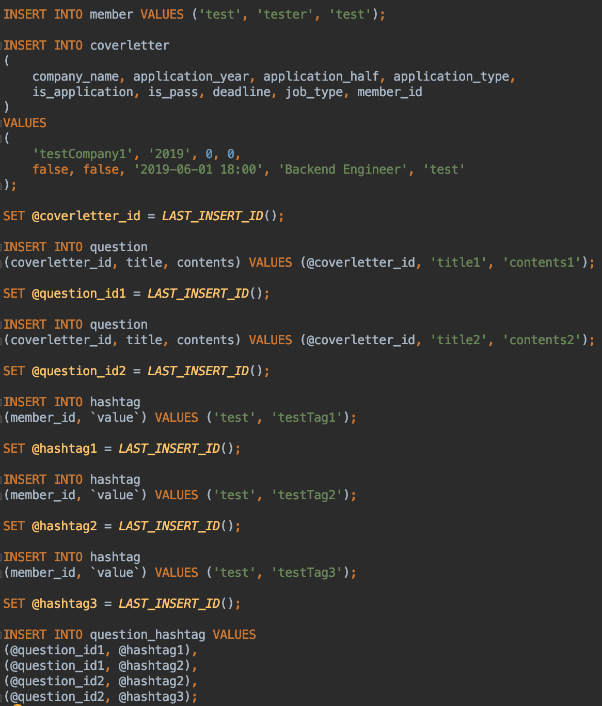

# 테스트 코드를 리팩토링 해보자 - 유지보수편

이번에 토이프로젝트를 하면서 처음으로 테스트 코드를 작성했습니다. 단위 테스트에 대한 이론적인 지식이나 JUnit을 사용하는 방법을 모른채 진행하다보니 DB, 성능, 코드스멜 등 여러 가지 문제점이 많았습니다.

Java 실무 경험이 없고, 책이나 웹을 통해 학습한 수준이라 오류가 있을 수 있습니다. 그래서 피드백은 언제나! 항상! 환영합니다.


## 리팩토링 목표

크게 2가지 기준을 잡고 리팩토링 계획을 세웠습니다. 

### [유지보수](./)

테스트 코드를 유지보수 관점에서 바라보고 리팩토링하는 과정을 다뤘습니다. 

여기서 언급하는 `유지보수`란 테스트 코드의 수정, 디버깅 등 테스트 코드를 이용한 모든 행위에 대한 효율성의 정도를 뜻 합니다. 낮은 유지보수성을 높이는 것이 목표입니다.

#### 참고
아래는 유지보수성이 낮은 테스트 코드의 특징입니다.
- test case의 목적이 명확하지 않아, 무엇을 테스트하는지 이해하기 어렵다.
- 하나를 바꾸면 열을 바꿔야 한다.
- 오류가 발생했는데 원인을 바로 찾기 어렵거나 디버깅하기 어렵다.
- 기타 등등

### 성능 (작성 예정)


# 문제 & 해결

## 1. 테스트 클래스 이름 문제


테스트 클래스 이름을 위와 같이 만들었습니다. 겉보기에 뭘 테스트하는지 유추는 어느 정도 가능해 보입니다만, 이렇게 했을 때 아래와 같은 문제점이 있었습니다.


어떤 테스트가 성공했는지, 실패했는지, 시간은 얼마나 걸렸는지 분별하기 힘듭니다. 처음 이렇게 네이밍한 이유는 domain package 안에 service, repository가 공통적으로 있으니 오히려 domain+ServiceTest와 같이 작성하는 것이 번거롭다고 생각했었습니다. 하지만 테스트 결과 분석이 어렵기 때문에 구체적으로 작성할 필요가 있었습니다.

무엇에 대한 테스트 결과인지 직관적으로 알 수 있도록 아래와 같이 수정했습니다.

```
변경 전 : coverletter/RepositoryTest.java 
변경 후 : coverletter/CoverletterRepository.java
```

## 2. 테스트 데이터 설정 문제

Repository 또는 Service 테스트를 하려면 필연적으로 데이터베이스를 사용해야 합니다. 따라서 테스트 코드에 초기 데이터를 설정하는 코드가 많습니다.

일례로 모든 Entity는 대체적으로 user를 참조하고 있기 때문에 @Before 메소드에 User Insert 코드를 가진 테스트 클래스가 6개나 있습니다. 만약 서비스가 더 커진다면? 수도 없이 많아지겠죠.

이를 해결하기 위해 상속을 사용해서 공통적인 로직을 처리하려는 생각을 했습니다. 하지만 상속은 대체로 쓰지 않는 편이 바람직하다는 말을 객체지향 공부할 때 많이 들어서 하기 싫었습니다. ~~다른 방법이 있음에도 상속을 사용한다는 것은 꼭 필요할 때 사용할 수 없는 문제가 생기고, 그러면 이거 수정하느라 또 고생해야 하고.... 끔직..~~

이를 해결하기 위해 선택한 방법은 초기 프로젝트 로딩시 필요한 데이터를 미리 데이터베이스에 저장하는 것입니다. spring boot에서는 data.sql을 통해 간단하게 구현할 수 있습니다.

resources에 data.sql 파일을 생성해주고 아래와 같이 필요한 데이터를 생성할 수 있는 query를 정의했습니다.



이제 application을 실행하고, 데이터베이스를 확인할 차례입니다. 잘 저장되었습니다 :)


이제 테스트를 위해 필요한 데이터가 마련되었으므로, 불필요한 로직을 제거할 수 있습니다! 테스트 클래스마다 존재했던 memberService bean과 TestObjectUtils 클래스를 제거했습니다.


## 3. 테스트 목적의 명확성 

Effective Unit Testing의 저자는 좋은 테스트 코드를 다음과 같이 정의했습니다.
> 테스트 대상이 `명확`하고, 결과를 신뢰할 수 있으며, 오류 발생시 쉽게 원인을 찾을 수 있는 가독성을 가진 코드

이 구절을 읽고, 제 테스트 코드를 천천히 살펴보니 문제가 바로 보이더군요. 바로 테스트 케이스의 목적이 너무 불분명했습니다. 실제 제가 작성한 테스트 코드를 예로 들어 설명하겠습니다.


```java
@Test
public void 자기소개서_저장() throws IOException {
    // given
    CoverletterDto.SaveReq req = loadDtoFromJsonFile("CoverletterNew.json", CoverletterDto.SaveReq.class);

    // when
    long coverletterId = service.save(member, req);

    // then
    CoverletterDto.ViewRes findCoverletter = service.getView(member, coverletterId);

    assertEquals(req.getCompanyName(), findCoverletter.getCompanyName());
    assertHasQuestions(findCoverletter, 2, "new");
    assertHasHashtags(findCoverletter.getQuestions(), 2, "new");
}
```

보시다시피 단순히 requestDto를 전달받아 '자기소개서'라는 Entity로 저장하는 테스트입니다. requestDto에 존재하는 데이터가 DB에 저장된 데이터와 일치하는지 검증하고 있습니다. 자기소개서 안에 문항, 문항 안에 태그도 잘 저장되었는지도 검증하고 있습니다.

처음에는 별 문제가 없는 테스트라고 생각했습니다. 하지만 이 테스트를 하려는 목적이 무엇일까? 라고 심각하게 고민한 결과 자기소개서를 저장할 때 자기소개서, 문항, 해시태그가 모두 저장된다는 것을 검증하고 싶었던 것입니다. 이 결론을 토대로 테스트 케이스를 재구성했더니 아래와 같은 결과가 나왔습니다.

```java
@Test
public void 자기소개서를_저장하면_문항도_저장되어야_한다() {
    // given
    CoverletterDto.SaveReq req = loadDtoFromJsonFile("CoverletterNew.json", CoverletterDto.SaveReq.class);

    // when
    long coverletterId = service.save(member, req);

    // then
    CoverletterDto.ViewRes findCoverletter = service.getView(member, coverletterId);

    assertThat(findCoverletter.getQuestions, hasSize(req.getQuestions.size()));
    
    // 생략 (루프를 돌면서 DB에 저장된 문항 값이 req와 같은지 확인하는 로직)
}

@Test
public void 자기소개서를_저장하면_해시태그도_저장되어야한다() { /* 생략 */ }

@Test
public void 자기소개서_문항없이_수정하면_문항갯수는_0() { /* 생략 */ }
```

메소드 네이밍이나 테스트 로직을 잘 작성했는지는 모르겠습니다. 하지만 단순하게 '자기소개서를 저장'하는 테스트 케이스보다 위와 같이 명확한 목표나 대상을 설정하는 테스트 케이스가 개발자의 의도를 표현하는데 더 도움이 된다는 사실을 알 수 있습니다. 테스트가 실패하더라도 메소드명으로 쉽게 유추할 수도 있겠네요! 

나중에 알고보니 이런 오류를 흔히 구현 테스트라고 부르네요. 구현 테스트는 지양하고 설계 테스트를 지향해야 한다고 합니다. (spring camp 2019 발표 자료 참고)


