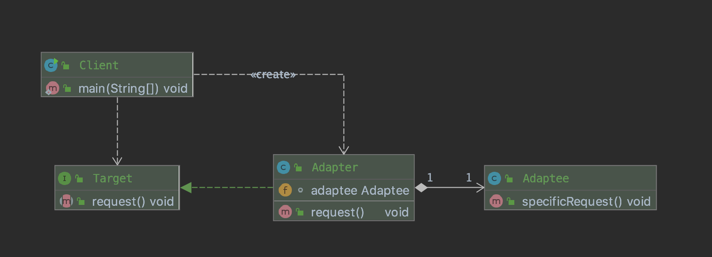

# Adapter Pattern

어댑터를 우리 말로 번역하면, 적응자라는 뜻 입니다. 어댑터는 특히 실생활에서 많이 볼 수 있습니다. 휴대폰을 충전하기 위해 220V 선을 사용하는 충전기 또한 어댑터라고 할 수 있습니다. 어댑터를 사용하는 이유는 다들 아시다시피 호환이 필요하기 때문입니다. 이 패턴을 사용하면, 호환되지 않는 인터페이스를 사용하는 클라이언트를 그대로 활용할 수 있습니다.

Head First Design Pattern에서는 Adapter Pattern을 다음과 같이 정의했습니다.

`
한 클래스의 인터페이스를 클라이언트에서 사용하고자 하는 다른 인터페이스로 변환하는 패턴
`

## 실제 경험담

제가 이전 회사에서 근무했을 때, 오픈마켓(지마켓, 11번가 등) 주문 관리 시스템을 개발 및 운영하는 업무를 담당했습니다. 오픈마켓 주문 관리 시스템이란 하나의 시스템에서 여러 오픈마켓들의 주문 상태를 통합적으로 관리할 수 있는 시스템입니다. 이 시스템은 외부 API를 사용해야 합니다. 해당 오픈마켓의 주문 내역을 조회하고, 또 처리해야 하기 때문입니다. 따라서 외부 API를 시스템에 이식해야 합니다.

시스템의 핵심 API는 아래와 같습니다.

```java
// 신규 주문 데이터를 조회한다.
Interface OrderNewRequest {
    public List<Order> request(); 
} 

// 주문 확인 데이터를 조회한다.
Interface OrderConfirmRequest {
    public List<Order> request();
}
```

그런데 github사의 주문 API를 시스템에 이식하려니 문제가 발생했습니다. github는 하나의 API에 신규주문, 주문확인 데이터를 모두 제공하더군요. 보통은 신규 주문, 주문 확인, 주문 취소 등 각각에 대해 하나의 API만 제공했었거든요.

첫 번째 대안은 그냥 중복으로 호출하는 방법입니다. 하지만 제가 분명 1개의 API에 2가지 데이터를 모두 제공한다고 했었죠? 그렇게 되면, 두 개의 클래스는 똑같은 API를 2회나 호출하게 됩니다. 즉, 낭비되는 자원이 발생합니다. 실제로 시스템에는 이와 같이 5개 이상의 Request Class가 존재했습니다. 그렇다면 4번의 호출 비용이 낭비되는 셈이죠.

```java
class GithubOrderNewRequest implements OrderNewRequest {
    @Override
    public List<Order> request() { ... }
}

class GithubOrderConfirmRequest implements OrderConfirmRequest {
    @Override
    public List<Order> request() { ... }
}
```

이를 해결하기 위해 저는 Adapter Pattern을 사용했습니다. 우선 어댑터가 `OpenMarketOrderRequest` 인터페이스를 구현하도록 했습니다. 각각의 주문 API(신규주문, 주문확인)를 제공해야 하기 때문입니다. 그 후 각각의 API가 실제 Github 주문 데이터를 조회 API를 중복호출 하지 않도록, 캐싱하는 방법을 활용해서 구현했습니다. 이렇게 하면 API를 중복으로 호출하지 않고도, 원하는 결과를 가져올 수 있습니다.

```java
class GithubOrderAdapter implements OpenMarketOrderRequest {
    
    List<GithubOrderData> receiveDatas;
    boolean isRequest;

    // 실질적으로 API를 호출해서 오픈마켓 주문 데이터를 가져옵니다.
    public void callApi() { 
        this.receiveDatas = httpRequest();
    }

    @Override
    public List<Order> getNewOrders() {
        if (isRequest) 
            return receiveDatas.filter(d => d.type == 0).map(d => Order.of(d));

        requestOrderDatas();
        return receiveDatas.filter(d => d.type == 0).map(d => Order.of(d));
    }

    @Override
    public List<Order> getConfirmOrders() {
        if (isRequest) 
            return receiveDatas.filter(d => d.type == 1).map(d => Order.of(d));

        requestOrderDatas();
        return receiveDatas.filter(d => d.type == 1).map(d => Order.of(d));
    }
}

class GithubOrderNewRequest implements OrderNewRequest {

    OpenMarketOrderRequest requestAdapter;

    @Override
    public List<Order> request() { 
        return requestAdapter.getNewOrders();
    }
}

class GithubOrderConfirmRequest implements OrderConfirmRequest {

    OpenMarketOrderRequest requestAdapter;

    @Override
    public List<Order> request() { 
        return requestAdapter.getConfirmOrders();
    }
}
```

## 일반적인(?) 다이어그램



위 다이어그램은 책이나, 인터넷에서 쉽게 볼 수 있는 Adapter Pattern의 다이어그램입니다. 클라이언트는 Adapter를 구현한 이식할 대상(Target)을 호출해서 사용합니다. Target에 구성된 Adapter는 Adaptee의 메소드를 대신 호출합니다. 

그런데 제가 설명한 예시와 다이어그램이 많이 다릅니다. 다이어그램을 따라한다면, orderNewRequest를 구현한 Adapter Class를 만들고, 클라이언트가 이를 호출해야 합니다. 하지만, 저는 `OpenMarketOrderRequest`라는 별도의 Target을 만들고, 이 Target을 직접 호출하는 것이 아닌 OrderNewRequest 및 OrderConfirmRequest 클래스로 감쌌습니다. 즉 다이어그램을 그대로 따르고 있지 않습니다.

업무를 하게 되면, 특히 제한적인 상황이 많은 것 같습니다. 시스템이 오래될수록, 변화하기 어렵기 때문입니다. 그래서 늘 제한적인 상황에 마주하게 됩니다. 그래서 최대한 현재 시스템의 상황과 타협해서 위와 같이 구현했습니다. 

## 정리

설계 상의 여러 문제점 중 유사한 여러가지 유형을 묶어서 만든 것이 디자인 패턴입니다. 그래서 디자인 패턴은 매번 공식 대입하듯 사용하긴 어렵습니다. 예측할 수 없는 여러 가지 상황이 있기 때문입니다. 예를 들어 Template Method Pattern은 추상클래스를 이용해 만드는 걸로 알려져있지만, Java의 Arrays.sort의 코드를 보면 comparator를 사용하는 로직도 Template Method Pattern의 일종이라고 합니다. 따라서 디자인 패턴은 유연하게 사용해야 합니다. 

부족한 글이지만 읽어주셔서 감사합니다 :)