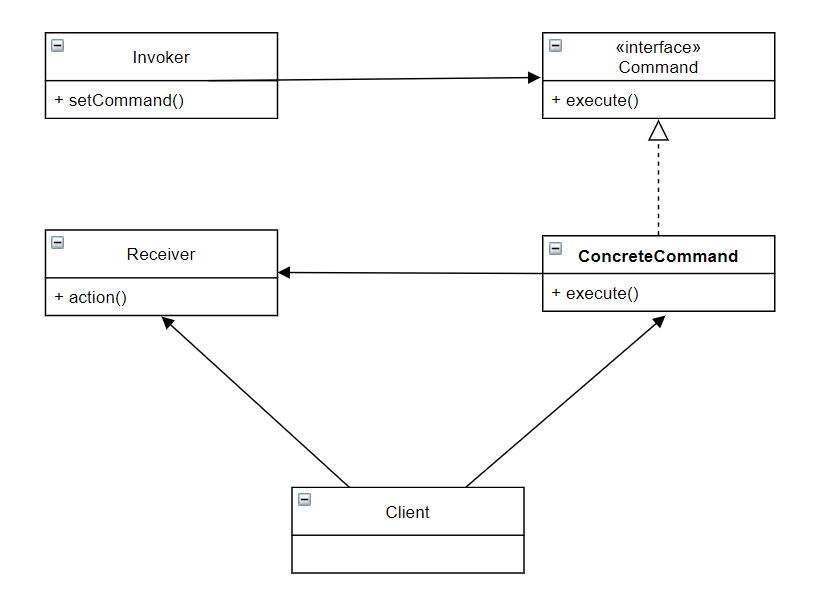

# Command Pattern
> 요청을 하는 객체와 그 요청을 수행하는 객체를 분리시킬 때 사용하는 패턴이다.

## UML

- Invoker : 커맨드를 실행하는 객체. 어떤 일을 처리해야하는지 모르고 단순히 커맨드만 실행한다.
- (Concrete)Command : 커맨드 인터페이스, Recevier에 특정 작업을 처리하라고 지시.
- Receiver : 요구사항을 수행하기 위해 어떤 일을 처리해야 하는지 알고 있는 객체.
- Client : 커맨드를 생성하고 리시버를 설정하는 객체

## 실제 예시
작업 Queue : 커맨드를 가져오고 execute만 호출하면 된다. 큐 객체는 각각의 작업들이 어떻게 실행되는지 알 필요가 없다. 단순히 커맨드 패턴을 구현하는 객체를 큐에 넣고, 큐는 이를 실행하면 된다.