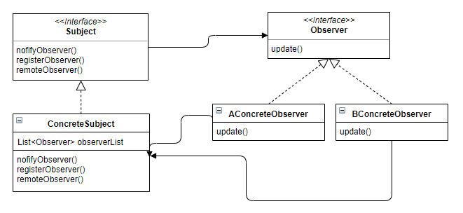

# Observer Pattern
> 한 객체의 상태가 바뀌면 그 객체에 의존하는 다른 객체들한테 연락이 가고 자동으로 그 객체들의 내용이 갱신되는 방식으로, 일대다 의존성을 정의하는 디자인 패턴이다.

## 설명
Subject는 특정 이벤트가 발생하면 자신에게 등록된 Observer들에게 특정 이벤트가 발생했다고 알린다. 그럼 Observer는 이벤트 후에 처리되는 각자의 행위를 수행한다.

예를 들어 Subject의 특정 데이터가 갱신되었을 때, Subject에 등록된 Observer에게 이 사실을 알리고, Observer의 구현 클래스는 각자 정의된 로직대로 후처리를 한다.

## UML

- Subject : Observer에게 데이터가 변경되었음을 알리는 주체
- IObserver : Observer Interface
- ConcreteObserver : IObserver의 구현체

## 실제 예시
Observer Pattern은 event 처리에서 많이 볼 수 있다. 예를 들어 Java Swing의 JButton 클래스를 보면, Listener를 등록/수정할 수 있는 메소드를 볼 수 있다. 이 때 Button 클래스는 Subject가 되고, 등록한 Listener가 Observer 클래스의 이벤트가 된다. 