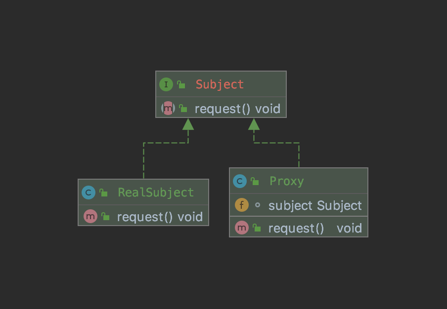

# Proxy Pattern

Proxy는 우리나라 언어로 해석하면 `대리`, `대신`이라는 뜻을 가지고 있습니다. Head First Design Patterns 에서는 Proxy Pattern을 다음과 같이 정의했습니다.

`어떤 객체에 대한 접근을 제어하기 위한 용도로, 대리인이나 대변인에 해당하는 객체를 제공하는 패턴`

Proxy의 종류 원격 / 보호 / 가상 / 캐싱 / 동기화 / 지연 둥 꽤 많습니다. 그만큼 이해하기 정말 어렵고 헷갈리는 패턴입니다.

## 보호 Proxy

일반적인 프록시 패턴의 클래스 다이어그램은 위와 같습니다. 보시면 알겠지만, 실제 객체(RealSubject)의 행위를 프록시가 대신하고, 클라이언트는 실제 객체 대신 프록시 객체를 호출하는 구조입니다. 그렇다면 왜 이렇게 귀찮은 방법까지 써가면서 이런 것을 해야되는지 의문을 품어볼만 합니다.

만일, 어떤 객체에 대한 접근 제어가 필요하다고 생각해봅시다. Person 클래스에 있는 개인정보는 자신만 볼 수 있고, 공개 정보는 모든 사람이 볼 수 있습니다. 이런 상황에서 Person 클래스를 수정하는 것은 그다지 합리적이지 않습니다. 조건이 늘어날 때마다 Person 클래스를 수정하는 일은 번거롭기 때문입니다.

그렇다면 어떻게 해야할까요? 대리자를 만들면 됩니다. Owner 프록시와 Non-Owner 프록시를 만들어서 Owner 프록시는 모든 데이터 조회를 허용하도록, Non-Owner 프록시는 공개 데이터 조회만 허용하도록 만들 수 있습니다. 

느낌이 좀 오시나요? 위 상황은 Proxy Pattern의 정의처럼 실제 객체에 대한 접근을 2가지 방법으로 제어하고 있습니다. 이런 상황에서 사용하는 Proxy를 `보호 Proxy`라고 합니다.

## 또 다른 예

JPA에서 사용하는 `지연 Proxy`가 있습니다. JPA는 연관 관계가 설정된 Entity를 로딩할 때, 지연 또는 즉시 Loading 전략을 사용합니다. 이 때 지연 로딩을 사용하는 경우, 연관관계 대상인 Entity를 Database에서 조회할 때 해당 Entity의 Proxy 객체를 반환합니다. 그리고 그 Entity를 실질적으로 조회할 때, 데이터베이스에 조회해서 실제 객체를 반환합니다.

이처럼 객체에 대한 접근을 제어하고 또 다른 행위를 수행하는 대리자 역할이 바로 프록시라고 말할 수 있습니다.

## 정리

지금까지 보호, 지연이라는 2개의 Proxy 종류를 살펴보았습니다. 목적은 다르나 근본은 같습니다. 객체에 대한 일차적인 접근을 제어해서 다른 결과를 낳고 있다는 점입니다.

프록시의 종류는 많지만, 근본만 알고 있다면 이해하는데 무리는 없을 것이라 생각합니다. 나중에 또 다른 종류의 프록시를 접한다면 추가해서 정리하겠습니다. 읽어주셔서 감사합니다.

