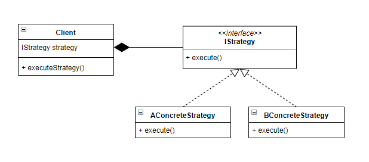

# Strategy Pattern
> 알고리즘군을 정의하고 각각을 캡슐화하여 교환해서 사용할 수 있도록 만든다. 이 패턴을 활용하면 알고리즘을 사용하는 클라이언트와는 독립적으로 알고리즘을 변경할 수 있다.

## UML


> Client: 전략을 사용하는 클래스 <br>
> IStratege: 행위의 인터페이스 <br>
> ConcreteStrategy: 인터페이스 구현체

## 실제 예시

Java를 사용하는 개발자라면, 한번 쯤은 Arrays.sort() API를 사용한 경험이 있을 것이다. Arrays.sort()의 두 번째 아규먼트로 비교 전략을 주입할 수 있는데 이것이 바로 Strategy Pattern을 적용한 것이다.

java
```
// 2번째 아규먼트를 익명 클래스로 구현하지 않고, Comparator를 구현한 클래스를 여러 개 만들어놓고 상황에 따라 주입해서 사용해도 된다.

Arrays.sort(anyList, new Comparator<Object>() {
    @Override
    public int compare(Object o1, Object o2) {
        return o1.compareTo(o2);
    }
});
```