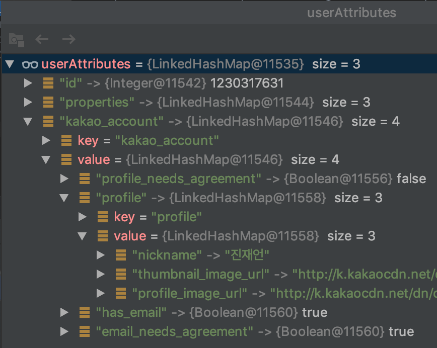

OAuth2를 연동하면서 생긴 디자인 문제를 해결하면서 정리한 글 입니다.

## 개요

지난 번에 [토이 프로젝트에 OAuth2를 연동해보자!](./토이%20프로젝트에%20OAuth2를%20연동해보자!%20feat%20Kakao.md)에서 Kakao Login API를 연동했습니다. 당시에는 구현에 급급해서 `작동만 하는 코드`를 작성했었는데요. 이번에는 다른 OAuth2 Provider를 추가하더라도 쉽게 유지보수할 수 있도록 코드를 수정해봤습니다.

## 문제 

우선 기존의 문제가 무엇인지 아래 코드를 통해 살펴보겠습니다. 아래 두 개의 메소드는 각각 OAuth2 인증이 성공했을 때 DB에 저장하는 메소드와 OAuth2 인증 후 JWT 토큰 발급하는 메소드입니다. 이 메소드들의 공통적인 문제점은 카카오 로그인 API Response를 파싱하는 코드가 있다는 것 입니다. 그렇다면 아래와 같은 문제가 발생할 것 입니다.
- 만약 다른 OAuth2 Provider가 추가되면, 이 코드도 수정되어야 하는 문제가 생깁니다. 아래 두개 메소드는 각각 DB에 저장하거나, JWT를 발급하는 책임이 있을 뿐 해당 유저가 OAuth 유저인지, 그렇다면 Kakao인지 Facebook인지, 아니면 일반유저인지 전혀 관심 없습니다.
- 카카오 API 자체가 변경되었을 때, 이 코드도 수정되어야 합니다. 이유는 위와 같습니다.


```java
public void saveAuthorizedClient(OAuth2AuthorizedClient oAuth2AuthorizedClient, Authentication authentication) {
    String providerType = oAuth2AuthorizedClient.getClientRegistration().getRegistrationId(); // kakao
    OAuth2AccessToken accessToken = oAuth2AuthorizedClient.getAccessToken(); 

    String id = authentication.getName();

    // 카카오 응답값 파싱
    LinkedHashMap<String, Object> properties = (LinkedHashMap<String, Object>) ((DefaultOAuth2User) authentication.getPrincipal()).getAttributes().get("properties");
    String name = (String) properties.get("nickname");

    OAuth2Member member = OAuth2Member.builder()
            .id(id)
            .name(name)
            .providerType(providerType)
            .accessToken(accessToken.getTokenValue())
            .expiresIn(LocalDateTime.ofInstant(accessToken.getExpiresAt(), ZoneOffset.UTC))
            .build();

    memberRepository.save(member);
}

public void onAuthenticationSuccess(HttpServletRequest req, HttpServletResponse res, Authentication authentication) {
    String id = authentication.getName();

    // 카카오 응답값 파싱
    LinkedHashMap<String, Object> properties = (LinkedHashMap<String, Object>) ((DefaultOAuth2User) authentication.getPrincipal()).getAttributes().get("properties");
    String name = (String) properties.get("nickname");

    String token = JWT.create()
            .withClaim("id", id)
            .withClaim("name", name)
            .withExpiresAt(new Date(System.currentTimeMillis() + SecurityConstants.EXPIRATION_TIME))
            .sign(Algorithm.HMAC512(SecurityConstants.SECRET.getBytes()));

    res.addHeader(SecurityConstants.HEADER_STRING, SecurityConstants.TOKEN_PREFIX + token);
}
```

위 메소드의 변화가 왜 문제일까요? 바로 객체지향 원칙 중 `개방 폐쇄의 법칙(OCP)`을 위반하기 때문입니다. 개방 폐쇄의 법칙이란, 클래스는 확장에 열려 있고 변화에는 닫혀 있어야 한다는 원칙입니다. 따라서 이 규칙을 따른다면, Kakao API Response에 의존하는 것이 아닌, 다수의 OAuth2 Provider에 유연하게 대응할 수 있어야 합니다.

## 해결

### 문제 해결 방법 찾기

먼저 이 문제를 해결하기 위한 간단한 방법이 있는지 생각해보겠습니다. 응답값을 파싱하는 부분을 별도의 클래스로 추출, 위임하면 쉽게 풀릴 것 같습니다. 하지만 이렇게 할거면 포스팅 안했겠죠? 분명히 별도로 지원해주는 무언가가 있을 것이라고 생각합니다. 그래서 OAuth2 인증 과정을 다시 한 번 자세히 살펴보았고, 아래와 같은 코드를 발견했습니다.

```java
public class DefaultOAuth2UserService implements OAuth2UserService<OAuth2UserRequest, OAuth2User> {
    
    public OAuth2User loadUser(OAuth2UserRequest userRequest) throws OAuth2AuthenticationException {
        // ... 생략
        ParameterizedTypeReference<Map<String, Object>> typeReference = new ParameterizedTypeReference<Map<String, Object>>(){};

        // OAuth2 회원 정보 조회 API의 Reponse를 파싱하는 코드
        Map<String, Object> userAttributes = (Map)this.userInfoResponseClient.getUserInfoResponse(userRequest, typeReference);
        GrantedAuthority authority = new OAuth2UserAuthority(userAttributes);
        Set<GrantedAuthority> authorities = new HashSet();
        authorities.add(authority);
        return new DefaultOAuth2User(authorities, userAttributes, userNameAttributeName);
    }
}
```



위 코드와 userAttribute의 응답값을 캡쳐한 이미지를 보시면, api 응답값을 파싱했다는 사실을 알 수 있습니다. 그렇다면 우리는 OAuth2 타입에 따라 적절한 맵핑 객체를 선택하고 생성하는 방법이 있을 수도 있겠다는 의문을 가져볼만 합니다. (예를 들어 OAuth2 요청 Provider가 Kakao라면 KakaoUserResponse 클래스를 생성하는 방법, 우리가 흔히 API Request를 DTO로 맵핑하는 Jackson 처럼요!)

우선 관련해서 확장할 수 있는지부터 한 번 알아봐야겠습니다. 아까 위 코드로 돌아가보면 반환 타입이 `DefaultOAuth2User`입니다. 심지어 Class 이름도 `DefaultOAuth2UserService`입니다. 그렇다면 뭔가 커스터마이징할 수 있는 여지를 제공해준 것은 분명하네요.

[Spring 공식 문서](https://docs.spring.io/spring-security/site/docs/current/api/org/springframework/security/oauth2/client/userinfo/package-tree.html)를 살펴봤더니, `CustomUserTypesOAuth2UserService`라는 클래스를 찾았습니다. 이 클래스는 **Custom OAuth2User Type을 지원**하는 OAuth2UserService의 구현체'라고 합니다. 프레임워크가 알아서 제공해주니 갖다 바치면 되겠네요.

### 적용하기

우선 적용하기에 앞서 `CustomUserTypesOAuth2UserService` 클래스를 어떻게 사용하는지 공식 문서를 참고했고, 다음의 글을 보았습니다.

> The custom user type(s) is supplied via the constructor, using a Map of OAuth2User type(s) keyed by String, which represents the Registration Id of the Client.

간단히 해석하면, Custom User Type을 Map에 담아 파라미터로 넘겨서 사용하라는 말이네요. 그리고 Map의 Key는 Client의 Registration ID로 설정하라고 합니다. 무튼 어디에다 설정해야 하는지 한참을 찾다가, 겨우 찾았네요. 코드로 말씀드리는게 빠를 것 같습니다.

```java
// OAuth2 설정 부분 - CustomUserType 추가
@EnableWebSecurity
public class WebSecurityConfig extends WebSecurityConfigurerAdapter {

    @Override
    protected void configure(HttpSecurity http) throws Exception {
        // authenticate
        http.authorizeRequests()
                .anyRequest().authenticated()
                .and()
                // oauth2 login 설정
                .oauth2Login()
                    // customUserType을 추가하면, 내부적으로 'CustomUserTypesOAuth2UserService' 클래스 사용
                    .userInfoEndpoint()
                        .customUserType(KakaoOAuth2User.class, "kakao").and()
                    .successHandler(new MyOAuth2SuccessHandler());
    }
}

// CustomUserType 추가 - OAuth2User 인터페이스를 구현해서 생성
@Getter
public class KakaoOAuth2User implements OAuth2User {

    private String id;

    @JsonProperty(value = "kakao_account")
    private Map<String, ?> kakaoAccount;

    public KakaoOAuth2User() {

    }

    @Override
    public Collection<? extends GrantedAuthority> getAuthorities() {
        return null;
    }

    @Override
    public Map<String, Object> getAttributes() {
        return Collections.singletonMap("id", id);
    }


    @Override
    public String getName() {
        if (!kakaoAccount.containsKey("profile"))
            return null;

        Map<String, String> profile = (Map<String, String>) kakaoAccount.get("profile");
        return profile.getOrDefault("nickname", "");
    }
}
```

위와 같이 코드를 작성하고, security에 설정했을 때 내부적으로 Client Registration ID와 비교해서 CustomUserType을 사용합니다. kakao의 경우 이전에 OAuth2 연동하면서 kakao라고 설정했기 때문에, 아까 security에 custom user type을 추가했을 때도 "kakao" 문자열을 넘겨준 것입니다.

아래는 개선된 코드입니다. Kakao API Response에 대한 의존성이 사라졌습니다. 이제 어떤 OAuth2 Provider를 연동하더라도 잘 대응할 수 있습니다. 문제해결 끝!

```java
@Override
public void saveAuthorizedClient(OAuth2AuthorizedClient oAuth2AuthorizedClient, Authentication authentication) {
    String providerType = oAuth2AuthorizedClient.getClientRegistration().getRegistrationId();
    OAuth2AccessToken accessToken = oAuth2AuthorizedClient.getAccessToken();

    OAuth2User oauth2User = (OAuth2User) authentication.getPrincipal();
    String id = (String) oauth2User.getAttributes().get("id");
    String name = oauth2User.getName();

    OAuth2Member member = OAuth2Member.OAuth2MemberBuild()
            .id(id)
            .name(name)
            .providerType(providerType)
            .accessToken(accessToken.getTokenValue())
            .expiresIn(LocalDateTime.ofInstant(accessToken.getExpiresAt(), ZoneOffset.UTC))
            .build();

    memberService.signUp(member);
}
```

## 끝으로

프레임워크는 진짜 대단합니다. 확장성 + 유연성 넘치는 디자인에 감탄했습니다. 그렇지만 우리 모두 프레임워크는 도구일 뿐이라는 사실과 배경지식이 중요하다는 사실을 잊지 맙시다 :-)

궁금한게 있으시면 언제든 메일 부탁드립니다. 감사합니다.