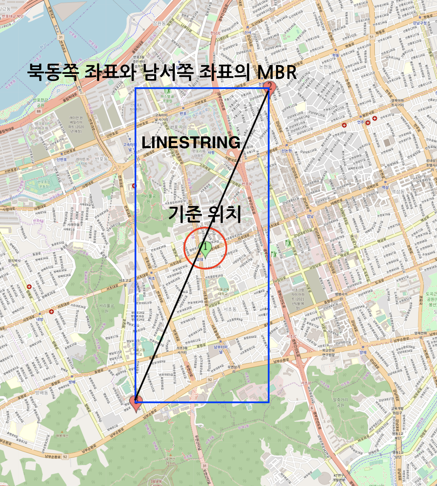

# 특정 구역에 포함되는 모든 데이터 찾기


## 개요

Spring Boot, JPA, MySQL과 Spatial Type을 활용해서 특정 구역에 포함되는 데이터를 찾는 방법을 정리했습니다.

## MySQL Spatial Data Type

MySQL 5.7부터 공간 데이터 타입을 지원합니다. 이것을 활용해 위치 데이터를 인덱싱할 수 있습니다. 우선 본격적인 실습에 앞서 알아두어야 할 용어부터 정리하고 넘어가겠습니다.

**[MBR](https://dev.mysql.com/doc/refman/5.7/en/spatial-relation-functions-mbr.html)** 
- Minimum Bounding Rectangles의 약자로, 최소 경계 사각형이라는 뜻 입니다. 
- 지도 상의 임의의 사각형 구역이라고 생각하시면 됩니다.
- 공간 관련 연산시 사용하는 용어입니다.

**[POINT](https://dev.mysql.com/doc/refman/5.7/en/gis-class-point.html)**
- 지도 상의 경도, 위도 값을 표현하는 객체입니다.
- MySQL의 Spatial Data Type 중 하나입니다.
 
**[LINESTRING](https://dev.mysql.com/doc/refman/5.7/en/gis-class-linestring.html)**
- 지도 상의 하나의 선을 의미하며, 일련의 Point들로 이루어진 객체입니다.
- MySQL의 Spatial Data Type 중 하나입니다.


## Practice In DBMS

먼저 DB를 활용해서 실습해보겠습니다. 최종적인 쿼리의 형태는 다음과 같습니다. 이 쿼리는 기준 좌표 x,y로 부터 nKM 떨어진 모든 범위의 gym_location 데이터를 조회하는 쿼리입니다.

```sql

# 기준 좌표 : x,y
# 기준 좌표의 북동쪽으로 nKM에 위치한 좌표 : x1, y1
# 기준 좌표의 남서쪽으로 nKM에 위치한 좌표 : x2, y2

SELECT *
FROM gym_location as g
WHERE MBRCONTAINS(ST_LINESTRINGFROMTEXT('LINESTRING(x1 y1, x2 y2)'), g.location);
```

SQL 설명
- MBRContains(g1, g2) : g1의 MBR에 g2의 MBR이 포함되는지 검사하는 함수
- ST_LINESTRINGFROMTEXT : WKT 표현식으로 표현된 문자열을 이용해 LINESTRING 객체를 만드는 함수

그림으로 보면 이해가 쉽습니다. 
- 기준 위치로부터 nKM 떨어진 북동쪽 및 남서쪽 좌표를 이은 대각선(LINESTRING)의 MBR은 직사각형입니다.
- 따라서 MBRContains(g1, g2)는 g1의 직사각형안에 g2 데이터가 포함되는지 찾는 연산입니다. 

<div style="text-align: center">
    
</div>


## Practice In Spring Boot + JPA

이번에는 Spring Boot, JPA 환경에서 실습해보겠습니다. 

### 개발 환경

- Spring Boot 2.x, 
- Hibernate 5.x, 
- MySQL 5.7
- Gradle

### 준비

1. Jpa에서 Spatial type을 사용하기 위한 의존성 추가

먼저 필요한 라이브러리에 대한 의존성을 추가해야 합니다. 필요한 라이브러리는 [hibernate-spatial](https://mvnrepository.com/artifact/org.hibernate/hibernate-spatial)입니다. 저는 Gradle을 사용하므로 아래와 같이 build.gradle 파일에 의존성을 추가했습니다.

```kotlin
dependencies {
    ...
    compile group: 'org.hibernate', name: 'hibernate-spatial', version: '5.4.4.Final'
}
```

2. property 수정하기

아래 application.yml 파일에서 database-platform을 `org.hibernate.spatial.dialect.mysql.MySQL56InnoDBSpatialDialect` 값으로 수정해주세요. 그 외 다른 설정들은 각자의 환경에 맞게 작성하시면 됩니다.

```yml
spring:
  datasource:
    driver-class-name: com.mysql.cj.jdbc.Driver
    url: jdbc:mysql://localhost:3306/test
    username: root
    password: 
  jpa:
    database: mysql
    database-platform: org.hibernate.spatial.dialect.mysql.MySQL56InnoDBSpatialDialect
```

3. Entity, Repository 추가

다음과 같이 Entity 및 Repository Class를 생성합니다. Entity에서 Point 타입 선언시 반드시 `org.locationtech.jts.geom` 패키지에 존재하는 Point 클래스를 Import 해주세요. 

여기서 Point 타입이란? MySQL의 Point 타입과 맵핑되는 데이터 타입으로 위도와 경도 데이터를 저장할 수 있는 클래스 입니다.

> MySQL의 Point 타입을 사용하기 위해 JPA에서 사용하는 데이터 타입을 구글에서 찾아보면, `com.vividsolutions` 의존성을 추가해서 Point 타입 객체를 import하는 레퍼런스를 많이 볼수 있습니다. 하지만 저의 경우에는 type이 맞지 않는 오류가 발생했습니다. `org.locationtech.jts.geom` 패키지에 있는 Point 클래스를 Import하면 타입 오류가 발생하지 않습니다.
 
```java
@Getter
@Entity
@NoArgsConstructor(access = AccessLevel.PROTECTED)
class User {

    @Id
	@GeneratedValue(strategy = GenerationType.IDENTITY)
	@Column
    private Long id;

    @Column
    private String name;

    // import org.locationtech.jts.geom.Point;
    @Column
    private Point location;
}
```

```java
@Repository
public interface UserRepository extends JpaRepository<User, Long> {
}
```

3-1 (참고) Point 데이터 DB에 저장하는 방법

```java
public void saveUser() {
    String name = "momentjin"
    Double latitude = 32.123;
    Double longitude = 127.123;
    String pointWKT = String.format("POINT(%s %s)", longitude, latitude);

    // WKTReader를 통해 WKT를 실제 타입으로 변환합니다.
    Point point = (Point) new WKTReader().read(pointWKT);
    User user = new User(name, point);
    userRepository.save(driverLocation);
}
```

4. 기준 좌표에서 북동쪽, 남서쪽으로 nKM 떨어진 좌표 구하는 연산

특정 위치에서 반경 nKM 이내 모든 데이터를 구하려면 MBR을 구해야 합니다. 아까 그림으로 보셨듯, 대각선을 통해 MBR을 구할 수 있다는 사실을 알았습니다. 하지만 대각선을 구하기 위해서 기준 위치에서 nKM 떨어진 북동쪽 좌표와 남서쪽 좌표가 필요합니다. 이를 구하려면 특정한 공식을 써서 구할 수 있습니다. 

찾아보니 어떤 분이 잘 정리해주신게 있습니다. 이를 참고하시는게 더 좋을 것 같습니다. -> [링크](https://pyxispub.uzuki.live/?p=1006)


### 실습

Java 코드로 표현하면 아래와 같습니다.

```java
public void test() {
    double baseLatitude = 37.511468; // 내 위치 y
    double baseLongitude = 127.121504; // 내 위치 x
    int distance = 2; // km 단위

    // 북동쪽 좌표 구하기
    Location northEast = GeometryUtils.calculateByDirection(baseLatitude, baseLongitude, 2, CardinalDirection.NORTH_EAST);

    // 남서쪽 좌표 구하기
    Location southWest = GeometryUtils.calculateByDirection(baseLatitude, baseLongitude, 2, CardinalDirection.SOUTH_WEST);
    
    double x1 = northEast.getLongitude();
    double y1 = northEast.getLatitude();
    double x2 = southWest.getLongitude();
    double y2 = southWest.getLatitude();

    // native query 활용
    Query query = entityManager.createNativeQuery("" +
            "SELECT g.name \n" +
            "FROM gym_location AS g \n" +
            "WHERE MBRContains(ST_LINESTRINGFROMTEXT(" + String.format("'LINESTRING(%f %f, %f %f)')", x1, y1, x2, y2) + ", g.location)"
    );
    query.setParameter(1, baseLongitude);
    query.setParameter(2, baseLatitude);
    query.setParameter(3, distance * 1000);
    
    List<?> result = query.getResultList();
}
```

## 마무리

원래는 매번 Table Full Scan해서 데이터를 필터링하고 조회해서 성능이 좋지 않았습니다. 이 방법을 사용하면 `Using Where` 전략을 사용하기 때문에 디스크 접근 빈도수가 대폭 감소합니다. 대용량 위치 데이터 조회시 이 방법을 쓰면 성능 향상에 도움이 될 것입니다.


## References

- https://pyxispub.uzuki.live/?p=1006
- https://purumae.tistory.com/198
- https://chang12.github.io/mysql-geospatial-index-1/