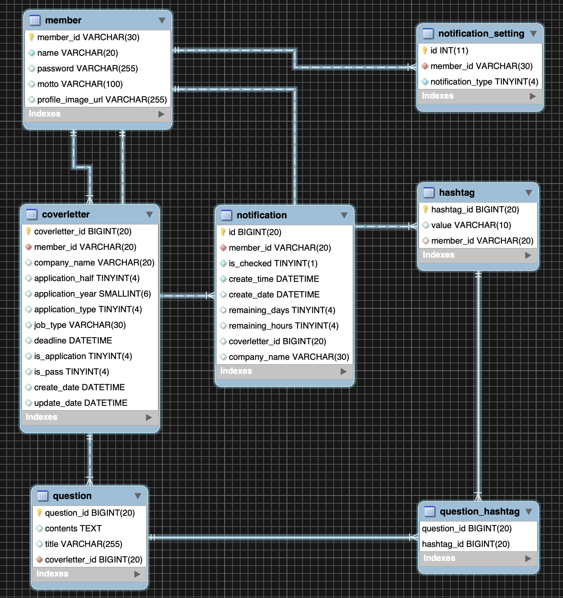
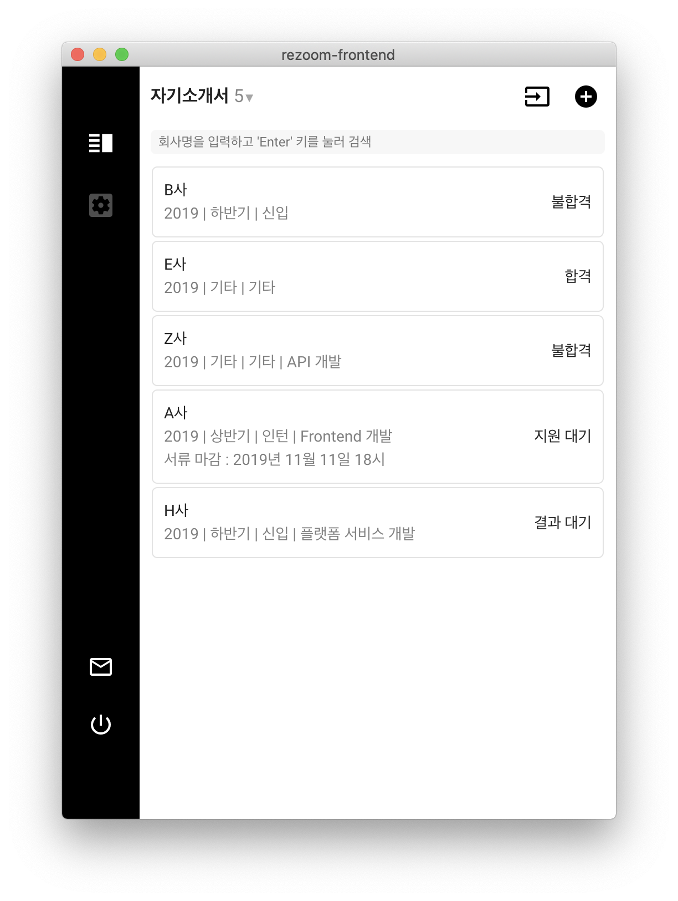
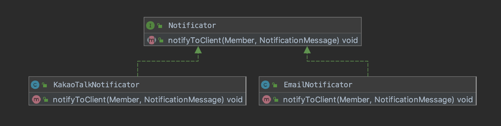
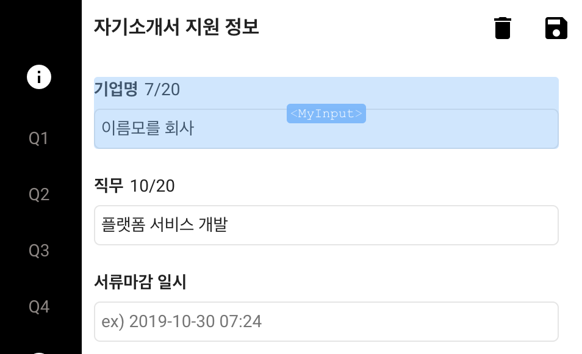

#  Re`Zoom(토이 프로젝트) 회고록

## 프로젝트 회고록을 작성하는 이유

지금까지 어떤 프로세스를 거치며 개발했고, 어떤 고민을 했고, 그 문제를 어떻게 해결했는지 돌아보는 시간을 갖기 위해 본 회고록을 작성했습니다.

## 목차

1. [개요](#개요)
1. [개발 환경](#개발-환경)
1. [개발 과정](#개발-과정)
    - [API 설계 및 개발](#API-설계와-개발)
    - [성능](#성능)
    - [API 인증 방법](#API-인증-방법)
    - [단위 테스트](#단위-테스트)
    - [유지보수성](#유지보수성)
    - [Front-end](#Front-end)
1. [마무리](#마무리)

---

## 개요

Re`Zoom이란? 
- 자기소개서 관리 어플리케이션입니다.
- IT 동아리 Nexters에서 처음 개발했고, 학습 목적으로 다시 개발한 프로젝트입니다. 

이 프로젝트를 다시 개발하는 구체적인 목적
- SPA 개발 경험 쌓기
- Java와 Spring에 대한 구체적인 학습 (Spring MVC의 실제 코드를 분석하며 익히는 동작 원리 등)
- 유지보수하기 쉬운 시스템을 만들기 위한 여러 가지 시도를 통한 학습 (단위 테스트 등)

---

## 개발 환경

### Backend

java 8, spring boot 2, mysql 8.0, jpa, junit5

### Frontend

vue, vuex, vue-router, javascript(es6), css3, html5, 

### ETC
git, github, travis ci

---

## 개발 과정

> 큰 범위에서 먼저 Backend를 개발하고, Client를 개발했습니다. 왜 이렇게 했는지 스스로에게 묻는다면, 사실 큰 뜻은 없습니다. 하지만 실제로 이렇게 해보니 적절한 API를 제공하기 위해선 Client에서 API를 호출하고 전달받은 데이터를 UI에 어떻게 바인딩할지 알아야 한다는 것을 깨달았습니다. 어떻게보면 당연한건데, Backend와 Frontend를 분리해서 작업하는 것이 처음이라 잘 몰랐습니다. 처음엔 DB 스키마 설계만 잘하면 적절한 API를 제공할 수 있다고 생각했습니다. 결국 DB 스키마 설계와 API는 별개였네요 ;)

### Backend

**Backend를 개발하기에 앞서 필요한 기능을 정리했습니다.** 필요한 기능은 다음과 같습니다.

- 로그인 (회원가입은 제외했습니다)

- 자기소개서 CRUD

- 문항 조회 : 유저가 자기소개서에 등록한 문항을 조회

- 자기소개서 마감일 알림 데이터 생성 및 조회 : 자기소개서가 마감일 N일 전일 때, 알림 데이터를 생성하고 조회

**그 후 DB 스키마를 설계했습니다.** 저는 프로젝트에 JPA를 도입했기 때문에 JPA의 기능을 사용하면 자동으로 스키마를 마이그레이션할 수 있지만, MySQL WorkBench를 사용해서 스키마를 직접 구현했습닌다. 완성된 스키마는 다음과 같습니다.



구조에 대해 간단히 설명하자면, 

- `[member]`는 `[coverletter]`, `[notification]`, `[notification_setting]`, `[hashtag]`를 여러 개(1:N) 갖고 있습니다. 한 명의 유저는 여러 개의 자기소개서, 알림 데이터, 알림 설정 값, 해쉬태그를 가질 수 있기 때문입니다.

- `[coverletter]`는 `[hashtag]`를 여러 개(1:N)개 갖고 있습니다. 하나의 자기소개서는 여러 개의 문항을 가질 수 있기 때문입니다.

- `[question]`과 `[hashtag]`는 N:M 관계입니다. 하나의 문항은 여러 개의 해시태그를 가질 수 있고, 하나의 태그는 여러 문항에 속할 수 있기 때문입니다.

#### API 설계와 개발
REST API의 일부 특징인 self-descriptive 조건만 만족하도록 API 이름을 지었습니다. 아래는 예시입니다.
- 자기소개서 리스트 조회 - GET : /coverletters
- 자기소개서 조회 - GET : /coverletters/{id}
- 자기소개서 생성 - POST : /coverletters

그리고 도메인별 Controller-Service-Repository의 일반적인(?) 3계층 구조로 API를 구현했습니다. 

API를 개발하면서 예외 처리가 특히 어려웠습니다. Framework가 지원하는 훌륭한 도구가 있었으나, 이것을 유지보수하기 쉽게 활용하는 것은 힘들더군요. 노하우를 얻고자 Spring Exception Best Practice 라는 키워드로 구글링 한 결과 [cheese10yun 블로그](https://cheese10yun.github.io/spring-guide-exception/)를 찾을 수 있었고, 이 블로그의 도움을 받아 손쉽게 해결할 수 있었습니다. 이를 통해 예외 처리의 핵심은 공통된 부분을 추상화해서 유지보수성을 높이고, Client가 활용하기 쉽도록 일관성 있는 Error Response를 제공해야 한다는 사실을 배웠습니다.

#### 성능

개발을 모두 끝내고 마지막에 성능 테스트를 했습니다. 사실 성능 측정에 대한 경험이 거의 없기 때문에 어떻게 해야할지 잘 몰랐습니다. 그래서 우선 의도대로 Query가 실행되는지 확인했습니다.

첫 성능 테스트 대상은 `자기소개서 리스트 조회 API` 였습니다. API를 호출한 유저의 자기소개서를 모두 조회하는 API입니다. 이 API는 자기소개서 정보만 반환하면 됩니다. 예를 들어 아래 스크린샷을 보면, 회사명/지원연도/지원종류/지원결과 등의 정보만 필요하다는 사실을 알 수 있습니다.



근데 query 실행 로그를 확인해보니 어마어마한 양의 Query가 실행되는 것을 확인할 수 있었습니다. 문제는 바로 연관 관계가 있는 Entity의 로딩 옵션이 EAGER(즉시) 모드였기 때문입니다. Coverletter Entity는 Question Entity와 1:N의 연관관계를 갖고 있으므로, N이 커지면 커질수록 쿼리 실행횟수가 증가합니다. 물론 페이징 처리와 자기소개서 내 문항 갯수 제한이 있어 성능에 큰 무리는 없을 수도 있습니다. 하지만 사용자가 많아진다면, 분명 부하가 걸릴 것은 당연해보입니다. 무튼 LAZY 모드로 변경했더니 2회의 Query가 실행되는 것을 확인할 수 있었습니다. (아! 그렇다고 항상 LAZY 모드가 효율적이진 않습니다!) JPA 작업시 반드시 Query Log를 확인해야 겠다는 깨달음을 얻었습니다. 

그 외 쿼리 실행계획을 확인하거나, 비즈니스 로직 중 비효율적인 부분이 있는지 검토하는 작업을 했습니다. version2를 개발할 땐 정확한 방법으로 성능 측정을 해볼 예정입니다.

#### API 인증 방법
아무나 API를 호출해서 리소스를 조회할 수 있다면, 데이터가 유출될 수 있습니다. 따라서 API 인증은 필수입니다. 인증 방법은 여러 방법이 있지만 저는 JWT를 선택했습니다. JWT는 토큰 방식의 인증 방식으로써, 토큰 내에 토큰 만료일 등의 데이터가 담겨 있기 때문에 상태를 저장하지 않아도 된다는 장점이 있습니다. 단점으로는 한번 발급되면 통제할 수가 없기 때문에 별도의 처리가 필요하다는 점입니다.

#### 단위 테스트
단위테스트는 처음 작성해봐서 어려움이 많았습니다. (물론 지금도 어렵고, 배워야할 부분도 많습니다) 도대체 무엇을 테스트해야 하는지 몰랐습니다. 그래서 그냥 메소드 1 : 테스트 1 기준으로 테스트 코드를 작성했었습니다. 하지만 이런 식의 테스트는 완벽하지 않다는 것을 배웠습니다. 단순히 메소드를 테스트하는 것이 아니라, 그 메소드를 구현한 의도를 테스트해야 합니다.

예를 들어 자기소개서를 저장하는 createCoverletter() 메소드가 있습니다. Coverletter 객체는 Question 객체를 여러 개 갖고 있고, 데이터베이스 저장시 JPA Cascade 속성으로 인하여 Question 객체도 함께 저장해야 합니다. 아래 코드를 참고하시면 어떤 의미인지 이해하기 쉬울 것 같습니다.

```java
// 변경 전
@DisplayName("자기소개서 저장 테스트")
public void coverletterSaveTest() { ... }

// 변경 후
@DisplayName("자기소개서 정보가 정상적으로 저장되어야 한다")
public void coverletterSaveTest1() { ... }

@DisplayName("자기소개서를 저장하면, 문항도 저장되어야 한다")
public void coverletterSaveTest2() { ... }
```

#### 유지보수성

소프트웨어는 끊임없는 요구사항으로 인해 변경되어야만 하는 특징이 있습니다. 이런 측면에서 높은 유지보수성은 소프트웨어가 요구사항에 유연하게 대응할 수 있도록 도와줍니다. 상대적으로 side-effect 없이 요구사항을 쉽게 처리할 수 있기 때문입니다.

본 프로젝트에서 유지보수성을 높인 경험은 총 2가지가 있습니다. 첫 번째는 [여기](https://github.com/momentjin/study/blob/master/TIL/design%20pattern/template%20method-pattern.md)에서 확인할 수 있고, 다른 하나는 이 곳에 직접 설명하고자 합니다.

- 현재 존재하는 기능 : 유저가 알림을 받겠다고 설정하면, 자기소개서 서류 마감일 N일전 이메일 알림을 송신
- 추가 요구 사항 : 카카오톡으로도 알림 수신할 수 있게 만들어주세요~!

위 요구사항을 종합해보면, 
  - 사용자는 알림 수신 방법을 0~N개 선택할 수 있어야 합니다.
  - 사용자가 설정한 알림 플랫폼을 통해 알림 메세지를 발신할 수 있어야 합니다.

이를 통해 앞으로의 미래 상황을 예측해보면, 또 다른 알림 방식을 추가 및 삭제할 수도 있습니다. 이를 유지보수하기 쉽게 만들기 위해 다음과 같은 구조로 개발했습니다.

우선 유저는 알림 선택 방법을 N개 가질 수 있어야 합니다. 따라서 유저는 알림 선택 방법과 1:N의 관계입니다. (상위에 있는 ERD 참고) 
```java
public class Member {
  ...
  private Set<NotificationSetting> notificationSettings;
}
```

알림을 송신하는 비즈니스 로직은 알림을 사용자가 어떤 알림을 설정했는지, 어떻게 알림을 보내는지 알 필요가 없습니다. 단지 알림을 보내는 역할만 담당하면 됩니다.

```java
public void sendNotifications() {
    List<Member> receivers = memberRepository.findAll();
    for (Member member : receivers) {
        // (생략) 해당 유저의 알림 데이터 조회
        // (생략) 유저의 알림 설정 조회
        // (생략) 알림 메세지 데이터

        // 유저가 갖고 있는 알림 객체를 이용해 알림 송신
        // (유저가 어떤 알림을 설정하든 관심없고 오로지 알림만 보내고 있다)
        for (NotificationSetting setting : notificationSettings) {
            setting.notifyToClient(member, message);
        }
    }
}
```

NotificationSetting은 Member가 갖고 있는 Entity입니다(아까 위에서 언급). 이것은 NotificationType이라는 상수를 갖고 있습니다. NotificationType은 실제 알림을 보낼 수 있는 객체를 (Notificator)를 갖고 있습니다.

```java
public class NotificationSetting {
    private long id;
    private Member member;
    private NotificationType notificationType;

    public void notifyToClient(NotificationMessage message) {
        notificationType.notifyToClient(this, message);
    }
}

public enum NotificationType {
    EMAIL(0, new EmailNotificator()),
    KAKAO(1, new KakaoTalkNotificator());

    private int typeNo;
    private Notificator notificator;

    ...

    public void notifyToClient(Member member, NotificationMessage message) {
        notificator.notifyToClient(member, message);
    }
}
```

실제로 알림을 송신하는 Notificator는 위와 같은 구조로 아래와 같은 구조를 형성하고 있습니다.



만약 이 상황에서 Slack 알림을 추가하고 싶다면? Notificator를 구현한 SlackNotificator 생성하고, NotificationType에 SLACK(2, new SlackNotificator())를 추가합니다. (그리고 Frontend에 유저가 해당 알림을 설정할 수 있도록 UI를 변경합니다)

이게 끝입니다. 기능 확장이 정말 쉽고, 일부 알림 방식을 지원하고 싶지 않으면 지우면 됩니다. 

----

### Front-end

**먼저 클라이언트 개발 환경을 선택해야 합니다.** 저는 vue.js를 사용해서 개발했습니다. spring은 thymeleaf 등의 템플릿 프레임워크를 사용해서 UI 구현이 가능하지만, SPA 개발 경험을 쌓아보고 싶었습니다. 가장 중요한 이유는 state 관리를 통해 데이터를 쉽게 핸들링할 수 있다는 장점이 있기 때문입니다. 

클라이언트는 크게 UI 설계 -> Component 설계 -> 데이터 설계(state) -> 컴포넌트 구현 순서로 개발했습니다. 

**UI 설계는 A4용지에 그려서 설계햇습니다.** 원래는 와이어프레임 도구를 쓰려고 했지만, 토이 프로젝트를 이렇게 복잡하게 해야하는지에 대한 의문이 들었습니다. 프로젝트 목표를 벗어났다고 생각했기 때문입니다.

**Component의 경우, UI 설계를 기반으로 공통적인 영역을 추리는 것부터 설계를 시작했습니다.** 예를 들어 아래 사진에서 왼쪽에 Navigation Bar는 화면이 전환되어도 계속 유지되어야 하는 영역이기 때문에 컴포넌트로 분류되어야 합니다.


특히 컴포넌트는 재사용성도 중요합니다 객체지향 프로그래밍에서 인터페이스를 사용해서 다형성을 활용하듯, 컴포넌트도 추상화가 이뤄져야 다양하게 활용할 수 있기 떄문입니다. 예를 들어 아래 사진에 MyInput Component는 상황에 따라 다르게 사용할 수 있습니다.



아래는 MyInput Component의 코드입니다. 해당 컴포넌트 값이 필수적으로 존재해야 한다면 required 프로퍼티를 true로 설정하면 되고, placeholder를 사용하려면 hint 값을 설정해주면 됩니다. 이렇게 한 번 작업해놓으면, 재사용과 유지보수가 편해서 정말 좋습니다. 이렇게 property를 이용하는 방법도 있고, 그 외에 mixin이나 상속을 이용하는 방법도 있습니다.

```javascript
<template>
  <div class="form-item-wrapper">
    <label class="form-item-label">{{ label }}</label>
    <span class="form-item-message">{{ ruleMessages }}</span>
    <input
      class="form-item-field"
      :disabled="disabled"
      type="text"
      v-model="myValue"
      :placeholder="hint"
    />
  </div>
</template>

<script>
export default {
  props: {
    label: {
      type: String,
      required: true
    },
    required: {
      type: Boolean,
      required: false,
      default: false
    },
    maxLength: {
      type: Number,
      required: false
    },
    rules: {
      type: Array,
      required: false,
      default: () => []
    },
    hint: {
      type: String,
      required: false
    },
    value: {
      type: String,
      required: true
    },
    disabled: {
      type: Boolean,
      required: false,
      default: false
    }
  },

  .... 생략
```

**컴포넌트를 모두 개발한 뒤, 완성된 컴포넌트에 API를 연동하는 작업을 진행했습니다.** vuex를 이용했기 때문에 정말 간단하게 연동할 수 있었습니다. 이 부분에 대한 특별한 이슈는 없었습니다. 그 외 클라이언트를 개발하면서 생긴 이슈는 많지만, 대부분 vue에 관한 문제이므로 소재가 부적합한 것 같아 패스합니다.

---

## 마무리

어떤 기술을 배우고 토이 프로젝트에 적용하는 것은 참 재밌는 학습 방법입니다. 비록 허접한 프로젝트였으나, 앞으로 더 발전시켜서 지식을 쌓아나가고자 합니다. 

앞으로 접해보지 못한 기술들을 적용할 예정이고, 꼭 기술이 아니더라도 클린코드와 같은 개발의 근간이 되는 영역까지 적용해볼 생각입니다.

항상 이슈가 있으므로 관련해서 PR 주시면 대단히 감사드리겠습니다 :)

부족한 글 읽어주셔서 감사합니다.


